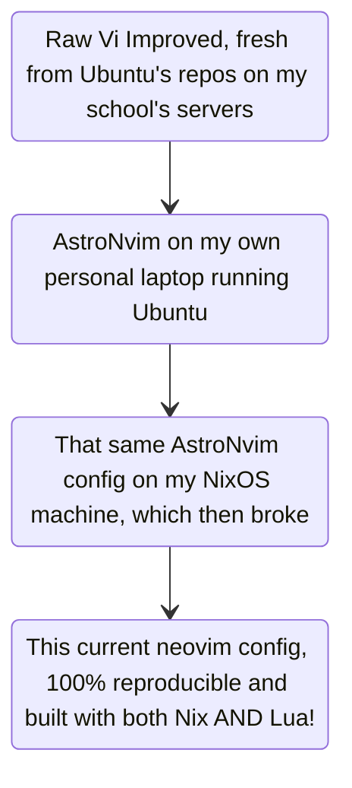

# internet_wizard's neovim configuration!

## Try it out!!

If you have nix installed, with the experimental flakes feature enabled, you can try my neovim config just by running

```shell
nix run 'github:internetwiz4rd/dotfiles?dir=.config/nvim'
```

## About

About as close to a "ground up" neovim config. Before this I was using
the AstroNvim distribution, which then broke on my NixOS machine.

My general (neo)vim journey has looked like:



I liked the idea of being able to declare my nvim config, and then run it with Nix. But I hated the idea of writing Lua, an already
unfamiliar language to me, in Nix strings without any formatting or LSP help. The [nixCats](https://github.com/BirdeeHub/nixCats-nvim)
project seemed like the answer to my prayers, but I was still learning flakes as a feature so it took me forever to be able to

1. Get it up and running
1. Actually adding it into my `configuration.nix` to run it and not have to enter an ephemral shell each time.

Couldn't let go of lazy.nvim to manage my plugins, so I went ahead with the [kickstart.vim](https://github.com/nvim-lua/kickstart.nvim)
template, which helped me better understand how to call plugin setups, write better lua for configs, and manage everything myself.
It very much feels like starting up NixOS for the first time, although having the previous experience from an opinionated, well-liked
distro like with Ubuntu or AstroNvim helped me figure out the workflow I wanted.

I haven't really modified the template much beyond adding and removing plugins and keymaps, but I'm meaning to take better advantage
of nixCat's eponymous categories to modularize my config.
